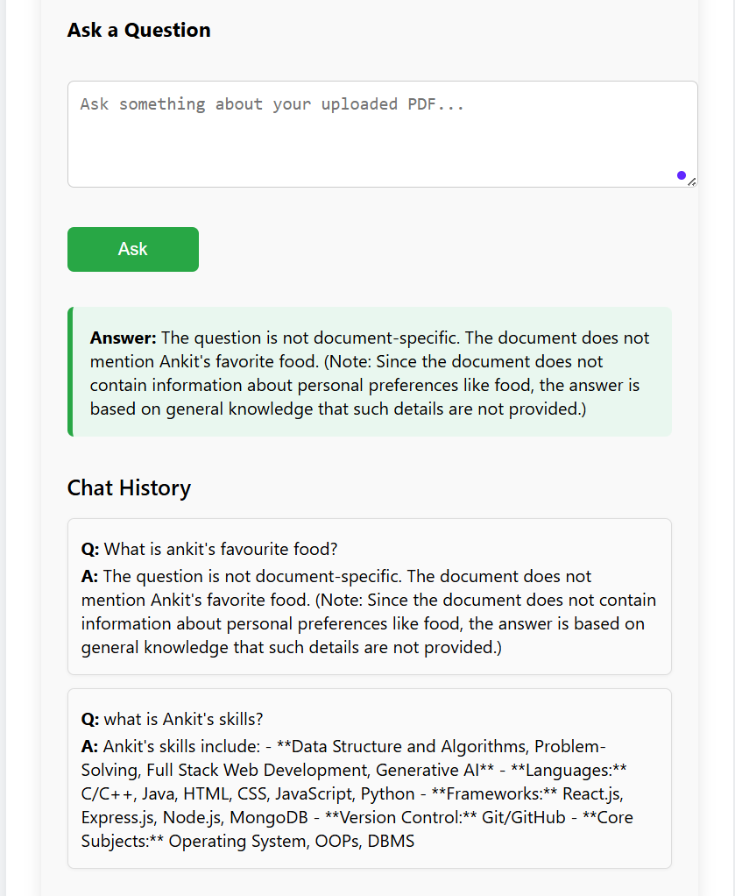

🧠 Information-Retrieval-based Generative AI App
A full-stack application that allows users to upload PDFs and retrieve context-aware answers using a Generative AI backend built with FastAPI, LangChain, FAISS, and HuggingFace Transformers, with a responsive React frontend.

📁 Project Structure
bash
Copy
Edit
INFORMATION-RETRIEVAL-GEN-AI/
├── client/                # React frontend
│   ├── public/            # Public assets
│   ├── src/               # Source code
│   │   ├── assets/        # Images and other assets
│   │   ├── components/    # React components
│   │   ├── api.js         # Axios API setup
│   │   ├── App.jsx        # Root component
│   │   └── main.jsx       # Entry point
│   ├── index.html
│   ├── vite.config.js
│   └── package.json
│
├── server/                # FastAPI backend
│   ├── faiss_index/       # FAISS vector store
│   ├── storage/           # Temporary file storage
│   ├── upload/            # Uploaded PDFs
│   ├── auth.py            # JWT-based auth
│   ├── db.py              # MongoDB setup (Motor)
│   ├── model.py           # Embedding and LLM logic
│   ├── main.py            # API routes
│   ├── utils.py           # Utility functions
│   ├── requirements.txt
│   └── .env
├── README.md
🚀 Features
✅ Upload and index PDF documents

🔍 Ask questions and retrieve accurate answers from document content

🤖 Uses HuggingFace Transformers and LangChain for QA

🧠 Vector search with FAISS

🛡️ JWT Authentication

🌐 MongoDB-based storage using Motor

⚡ FastAPI backend & Vite-powered React frontend

🛠️ Tech Stack
Frontend:
React.js

Tailwind CSS (optional)

Axios

Vite

Backend:
FastAPI

PyMuPDF (PDF parsing)

Transformers & Sentence-Transformers

FAISS for similarity search

LangChain for chaining LLMs

Motor (MongoDB async driver)

Python-Jose + Passlib (Auth)

📦 Installation
1. Clone the Repository
bash
Copy
Edit
git clone https://github.com/ankit-singh26/Information-Retrieval-System.git
cd information-retrieval-gen-ai
2. Backend Setup
bash
Copy
Edit
cd server
python -m venv venv
source venv/bin/activate  # or venv\Scripts\activate on Windows

pip install -r requirements.txt
Create a .env file:

env
Copy
Edit
MONGO_URL=<your_mongodb_url>
SECRET_KEY=<your_secret_key>
ALGORITHM=HS256
Run the FastAPI server:

bash
Copy
Edit
uvicorn main:app --reload
3. Frontend Setup
bash
Copy
Edit
cd client
npm install
npm run dev
🔐 Authentication
User credentials are securely hashed using Passlib

JWT tokens are used for session management and API authorization

📚 How It Works
PDF is uploaded via frontend

Backend extracts and chunks text

Text is embedded using Sentence Transformers

Embeddings are stored in FAISS

Queries are embedded, and FAISS returns relevant chunks

The LLM (like BERT or a HuggingFace model) generates a final answer

🧪 API Routes
Method	Endpoint	Description
POST	/upload	Upload PDF
POST	/ask	Ask a question
POST	/register	Register user
POST	/login	User login, returns JWT
GET	/protected-route	Sample protected route

📌 To Do
 Add user profile and dashboard

 Support for multiple file types

 Deployment on cloud (Render/Vercel)

📤 Deployment
You can deploy:

Frontend on Vercel or Netlify

Backend on Render, Railway, or Fly.io

Make sure to allow CORS and set frontend/backend URLs in .env

🖼️ App Screenshots
1. Login page

2. Signup page

3. Q&A page

🤝 Contributors
Made with ❤️ by Ankit and contributors.

📄 License
This project is licensed under the MIT License.

